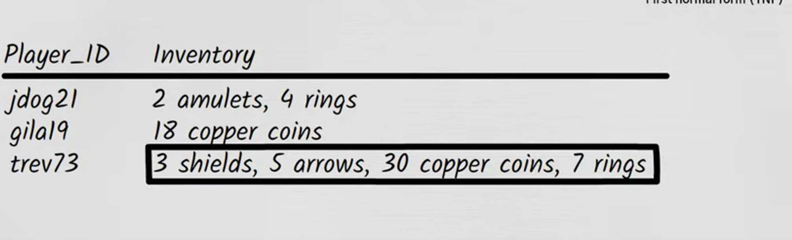
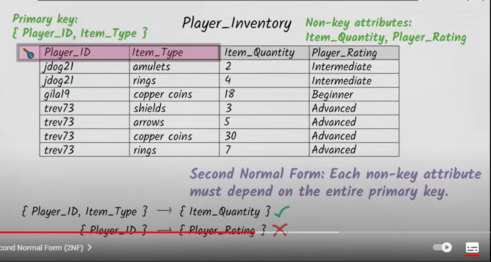

### **First Normal Form (1NF)** 
Definition:
A table is in the first normal form (1NF) if:

**All columns contain only atomic (indivisible) values.
Each column contains values of a single type.
Each column contains only unique values (i.e., each column is a set of values that are unique within that column).**

It violate 1NF

It suitable for the 1NF

### **Second Normal Form (2NF)**
Definition:
A table is in the second normal form (2NF) if:

**It is already in 1NF.
All non-key attributes are fully functionally dependent on the primary key.**
This means there should be no partial dependency of any column on the primary key. In other words, no non-key attribute should depend on only a part of the composite primary key.
It violate 2NF

It suitable for the 2NF

### **Third Normal Form (3NF)**
Definition:
A table is in the third normal form (3NF) if:

**It is already in 2NF.**
**There are no transitive dependencies, which means no non-key attribute depends on another non-key attribute.**
It violate 3NF

It suitable for the 3NF

