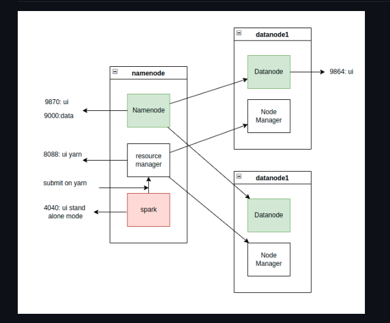
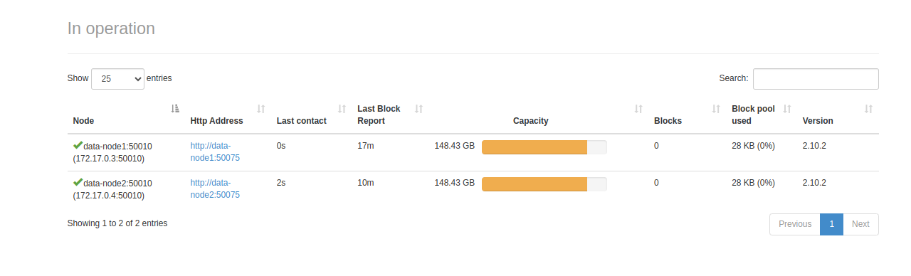
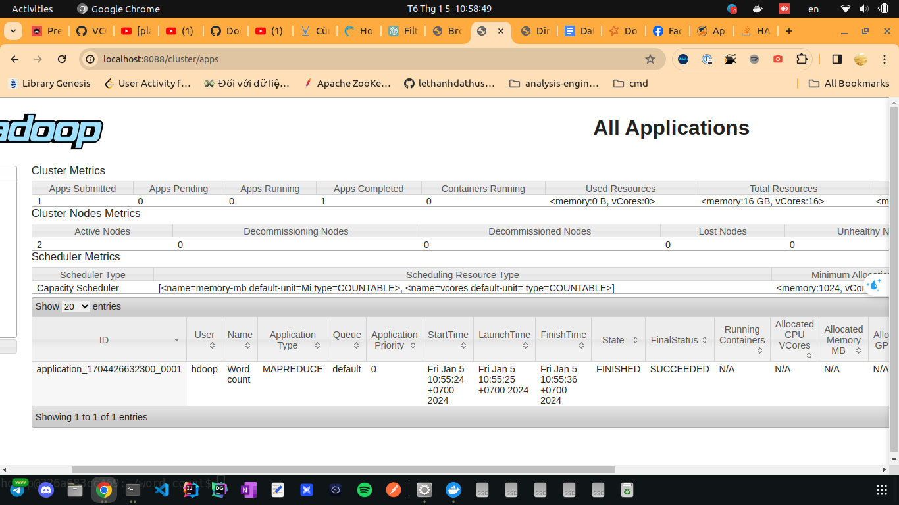
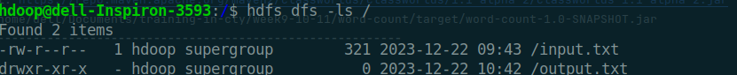
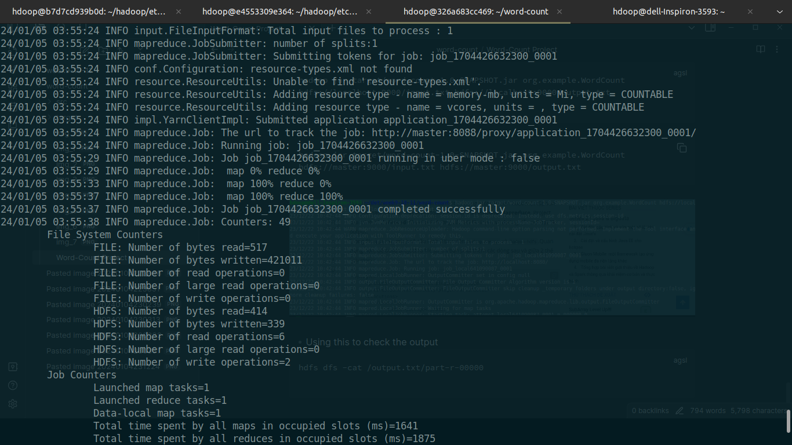
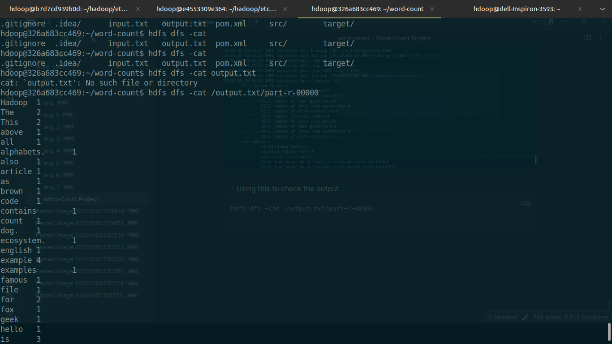
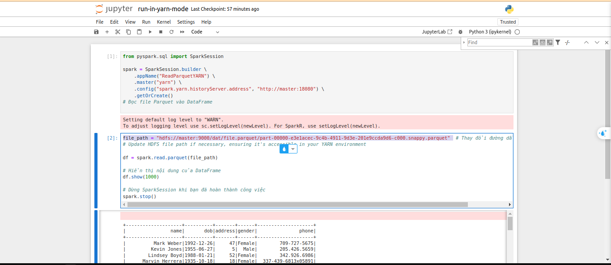
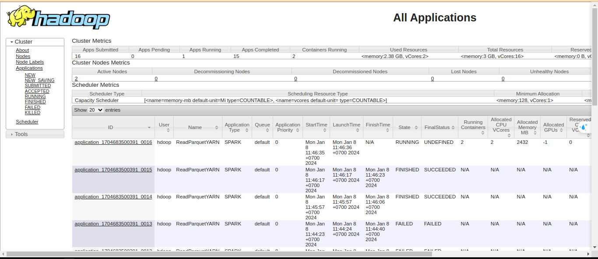
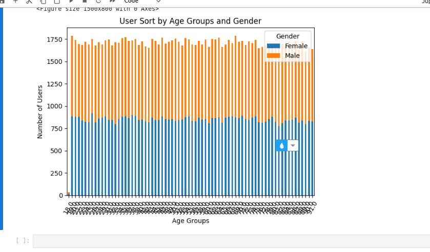

## Overview

- Build a hadoop cluster which spark runs with yarn

- Using docker to build each node
- 

## 2. Configure hadoop cluster

### Configure 

Create a network for hadoop-spark-network:

```$ docker network create hadoop-spark-network```

Run a container with image ubuntu:22.04
```
$ docker run -it --name namenode -p 9870:9870 -p 8088:8088 -p 19888:19888 --hostname master --network hadoop-network ubuntu:20.04
```

install the default java jdk

```
$ apt update
$ apt install -y wget tar ssh default-jdk 
```

Add hdoop user and grant permission
```
sudo adduser hdoop
sudo usermod -aG sudo hadoop
su - hdoop
```

Install OPEN SSH server , then generate Key with no password and Copy id_ras.pub to authorized_keys to make it become the authorized key for master node
```
sudo apt install openssh-server openssh-client -y
ssh-keygen -t rsa -P '' -f ~/.ssh/id_rsa
cat $HOME/.ssh/id_rsa.pub >> $HOME/.ssh/authorized_keys
```


### Install hadoop

Copy hadoop file from host

```
docker cp hadoop-2.10.2.tar.gz namenode:/home/hdoop
```
Extract the file

```
tar -xvf hadoop-2.7.3.tar.gz
sudo mv hadoop-2.7.3 /home/hdoop/hadoop

```

Adding Hadoop path and Java path to bash file : sudo nano ~/.bashrc


```
export HADOOP_HOME=/home/hdoop/hadoop
export PATH=$PATH:$HADOOP_HOME/bin
export PATH=$PATH:$HADOOP_HOME/sbin
export HADOOP_MAPRED_HOME=${HADOOP_HOME}
export HADOOP_COMMON_HOME=${HADOOP_HOME}
export HADOOP_HDFS_HOME=${HADOOP_HOME}
export YARN_HOME=${HADOOP_HOME}
```

Export Java path in file $HADOOP_HOME/etc/hadoop/hadoop_env.sh
```
export JAVA_HOME=/usr/lib/jvm/java-8-openjdk-amd64


```
Configure core-site.xml file in name node

```
<configuration>
<property>
  <name>hadoop.tmp.dir</name>
  <value>/home/hdoop/tmpdata</value>
</property>

    <property>
        <name>fs.defaultFS</name>
        <value>hdfs://master:9000</value>
    </property>
</configuration>
```
Configure hdfs-site.xml in name node

```
<configuration>

<property>
  <name>dfs.data.dir</name>
  <value>/home/hdoop/dfsdata/namenode</value>
</property>

 <property>
  <name>dfs.data.dir</name>
  <value>/home/hdoop/dfsdata/datanode</value>
</property>

<property>
  <name>dfs.namenode.http-address</name>
  <value>master:9870</value>
</property>

<property>
  <name>dfs.replication</name>
  <value>1</value>
</property>

 <property>
          <name>dfs.permissions.enabled</name>
          <value>true</value>
</property>

</configuration>


```
Configure yarn-site.xml file

```
<configuration>
    <property>
        <name>yarn.resourcemanager.hostname</name>
        <value>master</value>
    </property>
    <property>
        <name>yarn.nodemanager.resource.memory-mb</name>
        <value>-1</value>
    </property>
    <property>
        <name>yarn.nodemanager.resource.detect-hardware-capabilities</name>
        <value>true</value>
    </property>
</configuration>
```

Configure map-site.xml file

```<configuration>
    <property>
        <name>mapreduce.framework.name</name>
        <value>yarn</value>
    </property>
</configuration>
```

## 3. Run cluster
### 3.1 Run in one machine


```
hdfs namenode -format
start-all.sh
```
```
docker commit namenode hadoop-spark:v1
```
### 3.2 Run master with two slaves

Run new container 


```
docker run -it --name datanode1 --hostname datanode1 --network hadoop-network hadoop-spark:v1
```

```
docker run -it --name datanode2 --hostname datanode2 --network hadoop-network hadoop-spark:v1
```
Add new host name to workers file in namenode

Start hdfs and yarn in name-node




### 3.3 Run wordcount example 

We push the input.txt file to the HDFS
hdfs dfs: invoke the Hadoop file system shell command

-copyFromLocal input.txt / : Thhis command copy the file to the root directory ('/') of the HDFS.

```
hdfs dfs -copyFromLocal input.txt /
```


```
hadoop jar target/word-count-1.0-SNAPSHOT.jar org.example.WordCount hdfs://localhost:9000/input.txt hdfs://localhost:9000/output.txt
```

```
hadoop jar target/word-count-1.0-SNAPSHOT.jar org.example.WordCount hdfs://master:9000/input.txt hdfs://master:9000/output.txt 
```



```
hdfs dfs -cat /output.txt/part-r-00000
```



### 3.4 Setup spark run with yarn 
Download and setup
```
wget https://dlcdn.apache.org/spark/spark-3.3.4/spark-3.3.4-bin-without-hadoop.tgz
tar -xzvf spark-3.3.4-bin-without-hadoop.tgz 
mv spark-3.3.4-bin-without-hadoop spark
```
Setup the environment variable
```
export SPARK_HOME=/lib/spark
export PATH=$PATH:$SPARK_HOME/bin

```
```
$ source /etc/bash.bashrc
```
```
mv $SPARK_HOME/conf/spark-env.sh.template $SPARK_HOME/conf/spark-env.sh
```
Install and use jupyter

```
jupyter notebook --ip 0.0.0.0 --port 8888 --no-browser --allow-root
```
Using this code to generate data : khoảng 1 triệu bản ghi gồm các cột:‬
‭tên, ngày sinh, địa chỉ (địa chỉ random từ 1-100), giới tính, số điện thoại.‬
```
from pyspark.sql import SparkSession
from faker import Faker
import random


spark = SparkSession.builder.appName("CreateParquet").getOrCreate()

num_records = 1000000

fake = Faker()

data = []
for _ in range(num_records):
    name = fake.name()
    dob = fake.date_of_birth(minimum_age=18, maximum_age=90)
    address = fake.random_int(min=1, max=100)  # Địa chỉ từ 1 đến 100 (có thể thay đổi)
    gender = random.choice(["Male", "Female"])
    phone = fake.phone_number()
    data.append((name, dob, address, gender, phone))

columns = ["name", "dob", "address", "gender", "phone"]
df = spark.createDataFrame(data, columns)

df.write.mode("overwrite").parquet("hdfs://master:9000/dat/file.parquet")

spark.stop()

```

Test Spark to read file in yarn mode

```
from pyspark.sql import SparkSession


spark = SparkSession.builder \
    .appName("ReadParquetYARN") \
    .master("yarn") \
    .config("spark.yarn.historyServer.address", "http://master:18080") \
    .getOrCreate()


file_path = "hdfs://master:9000/dat/file.parquet/part-00000-e3e1acec-9c4b-4911-9d3e-201e9ccda9d6-c000.snappy.parquet" ay đổi đường dẫn file của bạn


df = spark.read.parquet(file_path)

df.show(1000)

spark.stop()

```




Visualize the data in yarn mode with jupyter
```


from pyspark.sql.functions import year, current_date
df = df.withColumn("age", year(current_date()) - year("dob"))

# Create age groups (e.g., 10-20, 20-30, ...)
df = df.withColumn("age_group", ((df["age"] / 10) * 10).cast("string"))

# Group by age group and gender, count users
grouped_df = df.groupBy("age_group", "gender").count().orderBy("age_group")

# Convert to Pandas DataFrame for visualization
pandas_df = grouped_df.toPandas()

# Pivot the data for plotting
pivot_df = pandas_df.pivot(index="age_group", columns="gender", values="count")

# Plotting stacked bar chart
plt.figure(figsize=(15, 8))
pivot_df.plot(kind="bar", stacked=True)
plt.xlabel("Age Groups")
plt.ylabel("Number of Users")
plt.title("User Sort by Age Groups and Gender")
plt.xticks(rotation=60)
plt.legend(title="Gender")
plt.tight_layout()
plt.show()

# Stop SparkSession
spark.stop()
```
Here is the result
